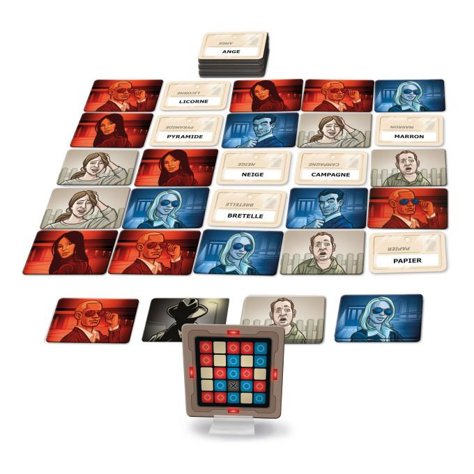

# CodingWeek 2025
**TELECOM Nancy - 06/01 au 10/01**

**LinguaCrypt** est un clone du célèbre jeu de société CodeNames™. Ce jeu stimule la réflexion stratégique, la créativité linguistique et la capacité à établir des connexions entre les mots. Il s'agit d'un jeu d'association d'idées et de déduction conçu pour 2 à 8 joueurs (ou plus, en équipes). Les joueurs sont divisés en deux équipes, chacune dirigée par un maître-espion. Sur une grille composée généralement de 25 mots, chaque maître-espion doit faire deviner à son équipe les mots correspondant à leurs agents secrets (indiqués sur une carte clé secrète) en utilisant des indices d'un seul mot, accompagnés d'un chiffre indiquant le nombre de mots associés.
L'objectif est d'être la première équipe à identifier tous ses mots sans tomber sur les agents adverses, les civils neutres ou l'assassin, un mot qui fait immédiatement perdre la partie.

## Sujet

Vous devez réaliser la conception et l'implémentation de ce jeu en Java/JavaFX.

Les principales fonctionnalités attendues sont :
- permettre à des joueurs de créer une partie en choisissant différents paramètres (taille de la grille, thématique de la liste de mots, nombre de joueurs, temps de réflexion limité ou non, etc.)
- permettre à des joueurs de jouer au jeu tout en s'assurant du respect des règles. Les [règles en français du jeu original](https://iello.fr/wp-content/uploads/2016/10/Codenames_rulebook_FR-web_2018.pdf) sont disponibles sur le site de l'éditeur de la version française IELLO ;
- permettre de sauvegarder/recharger une partie ;
- permettre d'éditer de nouvelles listes/thématiques de cartes "Nom de Code", ou de sélectionner/composer des jeux de cartes à partir des cartes existantes.

Il vous faudra proposer une manière pour que les maître-espions puissent consulter librement la carte "Clé", qui indique à quelle équipe appartient chaque "Nom de Code" pour une partie, sans que celle-ci puisse être visible par les autres joueurs. On peut imaginer une autre fenêtre qui serait affichée sur un autre écran ou l'accès à la carte sur un autre dispositif tel qu'un smartphone (par exemple, au travers d'un QR code)

En fonctionnalités complémentaires, vous devrez :
- intégrer un sablier interrompant le temps de réflexion d'un maître-espion si celui-ci est trop long. Vous pouvez implémenter un mode "blitz" où les temps des phases sont limités ;
- ajouter une [version "images"](https://iello.fr/wp-content/uploads/2017/03/CodenamesPictures_rulebook_FR.pdf) où les cartes codes comportent des images et non plus des mots. Il faudra permettre l'édition de ces nouvelles cartes ;
- ajouter un mode permettant à un seul joueur de jouer seul (par exemple, avec des indices préprogrammés) ;
- ajouter une gestion des statistiques sur les parties et les joueurs.

En fonctionnalités avancées, vous pourrez :
- ajouter un mode coopératif à deux joueurs tel que défini dans la [version Duo du jeu](https://iello.fr/wp-content/uploads/2017/11/Codenames-duo_rulebook_FR_light.pdf) ;
- permettre à plusieurs joueurs de jouer en réseau (un peu à la manière de Codenames Online - https://codenames.game/)
- proposer une intelligence artificielle 🤖

## Organisation

### Encadrement

Chaque groupe se verra assigner un enseignant référent. Chaque groupe rencontrera son enseignant à intervalles réguliers. Au cours des journées, un ou plusieurs enseignants seront disponibles pour répondre à vos questions. Ceux-ci seront joignables à travers la plateforme Teams ou dans une salle dont le numéro vous sera communiqué ultérieurement.

### Présence et assiduité

La semaine a été bloquée pour vous permettre de vous concentrer sur cette épreuve. Aucune salle de TD ou de TP n'est réservée spécifiquement, mais vous pouvez vous installer sans gêner les autres cours. Nous vous prions donc de bien vouloir libérer celle-ci lorsque des enseignements y sont prévus dans la semaine. Il vous est demandé d'indiquer régulièrement à votre encadrant(e) dans quelle salle votre groupe se trouve.

### Travail et collaboration

Suite à l'enregistrement de votre groupe, un dépôt privé Git vous a été créé où vous déposerez le code source et les différentes informations nécessaires à la compilation et à l'exécution de votre application (Java).

Il est nécessaire de bien organiser le contenu de ce dépôt et de "commiter" régulièrement afin que l'ensemble des membres du groupe ait accès aux données les plus récentes. Il sera tenu compte des contributions de chacun des membres du groupe. Si un des membres n'a pas su "commiter" ses contributions, nous considérerons sa participation comme nulle.

Vous devrez :
- documenter la planification et l'avancement du projet ;
- vous assurer des livraisons (*releases*) **quotidiennes** et de la bonne utilisation de Git ;
- mettre en œuvre des tests et des procédures assurant la qualité du logiciel ;
- documenter votre architecture et votre conception pour les rendre compréhensibles ;
- documenter l'installation et l'exécution de votre application.

## Évaluations et rendus

Le développement se fait de façon **itérative et incrémentale**. Vous devez produire **un logiciel opérationnel chaque jour**. Vous y ajouter des fonctionnalités en fonction d'une feuille de route (*roadmap*) que vous aurez définie à l'avance et que vous ferez évoluer en fonction de votre avancée (celle-ci doit être présente dans le dépôt de votre projet). Il n'est pas question d'avoir plusieurs morceaux de programmes fonctionnant indépendamment les uns des autres. Le programme doit être intégré à chaque fin de journée et vous devez à tout moment pouvoir faire une démonstration de la dernière livraison (ce qui ne devrait pas être un problème grâce aux branches et aux tags Git). 

Le document `README.md` de votre dépôt doit indiquer comment exécuter ce programme.

Nous vous recommandons d'utiliser un outil tel que Gradle pour automatiser la compilation, l'exécution des tests et la construction de votre application.

### Rendus intermédiaires

Chaque groupe devra effectuer un **rendu journalier** sous la forme de commits Git (cela ne signifie pas qu'il faut se limiter à un commit par jour dans le dépôt, bien au contraire). Ce rendu devra être étiqueté (au moyen de la commande `git tag` dans la branche `main`) selon la convention de nommage suivante : `RELEASE_DAY_X` où `X` indique le jour de la semaine (numéroté à partir de 1). Il s'agira d'une livraison, donc d'un système "déployable" et opérationnel. Par défaut, la commande `git push` ne partage pas les tags, il faut explicitement partager ces tags (en utilisant l'option `--tags`).

La contribution de chacun des participants d'un groupe pourra être mesurée à son activité sur GitLab, i.e. le nombre de commits qu'il aura pu faire et leur taille. Il ne sera pas admis que certains d'entre vous n'aient pas "commité" de code à leur nom. Il est donc important de bien configurer votre client Git afin que vos commits vous soient attribués (Vérifiez les variables `user.name` et `user.email` au moyen de la commande `git-config --list`).

### Rendu final

Le rendu final sera étiqueté (toujours la branche `main`) selon la convention de nommage suivante : `RELEASE_FINAL`.

Il devra comporter a minima :
- les documents d'analyse et de conception que vous aurez réalisés ;
- le code source de l'application client lourd (Java), les instructions textuelles (texte brut ou fichier PDF) indiquant comment compiler, configurer et exécuter cette application (précisant les dépendances externes et comment avoir accès à ces dépendances) ;
- une version facilement exécutable de votre application (avec les instructions pour l'exécuter).

Les derniers commits auront lieu **avant 17 heures le vendredi 10 janvier 2025**.

Il ne sera pas possible de faire de démonstration le dernier jour. Vous nous rendrez une démonstration de 10 minutes de votre application sous la forme d'un *screencast* présentant ses fonctionnalités. Vous pouvez utiliser un outil de capture d'écran tel que [OBS Studio](https://obsproject.com/) ou tout autre outil. L'objectif de cette vidéo est de montrer les fonctionnalités de votre application, mais également d'en faire la promotion. Généralement, ce genre de vidéo est accompagné d'un commentaire audio et déroule un ou plusieurs scénarios de démonstration. Le plus simple est de déposer votre vidéo sur une plateforme en ligne telle que YouTube™ ou Dailymotion™ et de publier ensuite le lien dans votre fichier `README.md` de votre dépôt Git (ce n'est pas un problème si le commit publiant ce lien est réalisé après l'heure de rendu limite de
votre projet).

### Critères d'évaluation

- Les résultats concrets présentés à la fin de la semaine ;
- le respect des méthodes ;
- l'organisation du travail ;
- la mise en œuvre de tests démontrant le fonctionnement du logiciel ;
- la qualité du développement (principe de conception mis en œuvre, architecture adaptée) ;
- l'usabilité de votre application ;
- l'invention de nouveaux services et caractère innovant du logiciel.

## Communication avec l'équipe pédagogique

Afin de poser vos questions et de discuter durant la semaine, nous avons créée sur la plateforme de messagerie Microsoft Teams™ une équipe avec différents canaux (nous créerons un canal pour chaque équipe également). N'hésitez pas à y poser des questions sur le sujet ou sur des points techniques.

Afin de rejoindre l'équipe dédiée à la codingweek, vous devrez utiliser [ce lien d'invitation](https://teams.microsoft.com/l/team/19%3AowGutRd2Hw_qufyFHCVuL76VKd8mWy-BlrA9VAJa2gk1%40thread.tacv2/conversations?groupId=1da79dcb-0c08-4834-b5d6-a4682857b9af&tenantId=158716cf-46b9-48ca-8c49-c7bb67e575f3) à votre première connexion.

Afin de centraliser les différentes réponses, nous avons mis également en place un [document FAQ partagé](https://docs.google.com/document/d/1o9gKqfAO9SJfs1xKiDWOehlPJk40lhM4TDPOC14dkzw). N'hésitez pas à consulter/éditer ce document régulièrement au cours de la semaine : 
